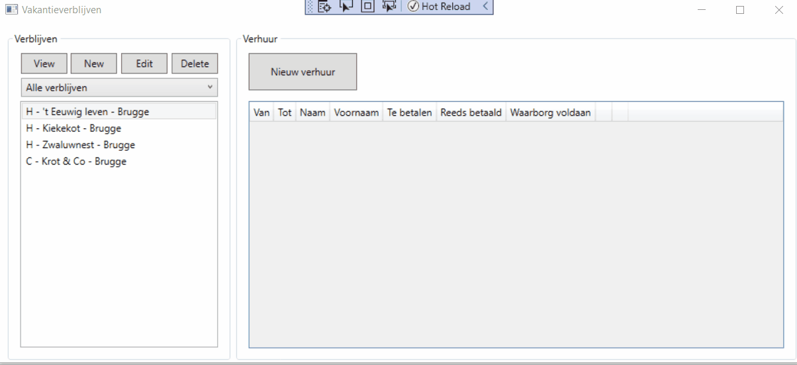

# Oefening geavanceerde klassen: vakantieverhuur

In deze oefening gaan we aan de slag met onze eigen geavanceerde klassen om een applicatie te bouwen die vakantieverhuur regelt. Uiteindelijk moet de applicatie er ongeveer uitzien zoals in onderstaande animatie.

## Class library

De solution bevat reeds een class library project met naam **Pra.Vakantieverhuur.CORE**. Hierin zijn ook reeds een aantal (hoofdzakelijk lege) klassen voorzien. De gewenste overerving tussen klaasen hebben we wel al voor jullie gedefinieerd.

We hebben de klassen ondergebracht in twee mappen:

- **Entities**
- **Services**

De map **Entities** bevat de klassen die de nodig hebben om verblijven, personen en huurovereenkomsten te modelleren. De map **Services** bevat op zijn beurt de overeenkomstige klassen die we zullen gebruiken om de entiteiten te beheren: ze houden een lijst bij van alle aangemaakte objecten van de betreffende entiteit en bieden methoden aan om deze entities op te vragen of aan te passen (CRUD).

> **Merk op:** we gebruiken hier dus dezelfde onderverdeling in entiteiten en services zoals we die geïntroduceerd hebben in het hoofdstuk over connected databases. Achter de services in deze oefening zit echter geen databank, ze slaan de aangemaakte objecten gewoon op in het lokale geheugen (en verliezen dus ook hun data als de applicatie opnieuw gestart wordt).
>
> Je merkt hier nogmaals hoe interessant het is om bij het werken met databases dit volledig af te schermen achter je services in de applicatielaag: je kan in feite deze services zomaar omwisselen met services die hun data op een andere manier beheren, zonder de presentatielaag (WPF) te moeten wijzigen. In de WPF moet en wil je niet weten of de data nu in een database zit, in het computergeheugen, misschien wel opgeslagen wordt in lokale bestanden, ... of wat dan ook.

### Entities

De map **Entities** van de class library bevat volgende klassen:

#### Residence

Gemeenschappelijke superklasse van de verschillende soorten verblijven. Heeft volgende eigenschappen:

- **ID** = fullprop, readonly, string, wordt gevuld met GUID in constructor
- **BasePrice**  (basisprijs) = fullprop, decimal, waarde >= 0
- **ReducedPrice** (verminderde prijs) = fullprop, decimal, waarde >= 0
- **DaysForReduction** (aantal dagen vooraleer ReducedPrice van toepassing is) = fullprop, byte, max waarde = 100
- **Deposit** (waarborg) = fullprop, decimal, waarde >= 0
- **MaxPersons** (max aantal personen) = fullprop, int, waarde van 1 t/m 20
- **StreetAndNumber** = prop, string
- **ResidenceName** = prop, string
- **Town** = prop, string
- **PostalCode** = prop, string
- **Microwave** = prop, bool, nullable
- **TV** = prop, bool, nullable
- **IsRentable** = prop, bool

De constructor heeft **geen parameters** maar stelt wel de ID reeds in.

#### VacationHouse

Stelt een vakantiewoning voor en erft over van **Residence**. Aanvullende eigenschappen:

- **DishWasher** = prop, bool, nullable
- **WashingMachine** = prop, bool, nullable
- **WoodStove** = prop, bool, nullable

De methode `ToString()` wordt overschreven en geeft `"H - {ResidenceName} - {Town}"` terug.

#### Caravan

Een ander type verblijf, die dus ook overerft van **Residence**. Aanvullende eigenschap:

- **PrivateSanitaryBlock** = prop, bool, nullable

Ook hier wordt de methode `ToString()` overschreven, maar deze keer wordt er `"C - {ResidenceName} - {Town}"` teruggegeven.

#### Person

Stelt de basiseigenschappen van een persoon voor:

- **Name** = prop, string
- **Firstname** = prop, string
- **Address** = prop, string
- **Town** = prop, string
- **Country** = prop, string
- **Phone** = prop, string
- **Email** = prop, string

#### Tenant

Stelt een huurder voor. Een huurder is een specifiek soort persoon, dus deze klasse erft over van **Person**. Aanvullende eigenschap:

- **IsBlackListed** = prop, bool, default value = false

Overschrijft `ToString()` met resultaat `"{Name} {Firstname} - {Country}"`.

#### Rental

Beschrijft een huurovereenkomst van een bepaald verblijf aan een bepaalde huurder. Eigenschappen:

- **HolidayResidence** = prop, Residence
- **HolidayTenant** = prop, Tenant
- **DateStart** = prop, DateTime
- **DateEnd** = prop, DateTime
- **IsDepositPaid**= prop, bool
- **Paid** = prop, decimal
- **ToPay** = prop, decimal

### Services

De map **Services** van de class library bevat volgende klassen:

#### Rentals

Beheert de huurovereenkomsten (type **Rental**):

- **AllRentals** = fullprop, readonly, List\<Rental\>
  
De constructor heeft geen parameters en initialiseert een lege lijst van huurovereenkomsten.

#### Residences

Beheert alle aangemaakte verblijven:

- **AllResidences** = fullprop, readonly, List\<Residence\>

Constructor heeft geen parameters maar maakt wel reeds een paar (hard gecodeerde) verblijven naar keuze aan die beschikbaar zijn wanneer de applicatie opgestart wordt. Eventueel kan je dit randomiseren.

#### Tenants

Beheert de door het systeem gekende huurders:

- **AllTenants**, fullprop, readonly, List\<Tenant\>

Ook in deze parameterloze constructor worden reeds een paar (hard gecodeerde) huurders naar keuze aangemaakt. Opnieuw kan je dit eventueel randomiseren.

## WPF

Er is ook reeds een WPF project aanwezig met de naam **Pra.Vakantieverhuur.WPF**. Hierin is de volledige GUI reeds voorzien, ondergebracht in drie vensters:

- **MainWindow:** dit is het hoofdventser, waarin de applicatie opstart. Er wordt links een overzicht van de gekende verblijven getoond, en biedt knoppen aan om deze verblijven aan te passen (CRUD). Je kan via de combobox ook aangeven of je alle verblijven, of enkel de vakantiewoningen of caravans wil zien. Rechts krijg je een (initieel leeg) overzicht te zien van de afgesloten huurovereenkomsten en kan je een nieuwe overeenkomst registeren. Zodra er een overeenkomst aangemaakt is, kan je die ook bewerken of verwijderen via de knoppen die in de datagrid verschijnen op de rij van deze overeenkomst.
- **WinResidences:** in dit venster kan je de verblijven beheren. Het dient geopend te worden wanneer je op de knop "New" of "Edit" drukt in het paneel waar de verblijven getoond worden op het hoofdvenster.
- **WinRental:** dit venster dient geopend te worden wanneer je in het hoofdvenster op de knop "Nieuw verhuur klikt". Je kan er alle gegevens van de af te sluiten huurovereenkomst invullen en bewaren. Vervolgens komt deze overeenkomst in het overzicht op het hoofdvenster terecht. Per aangemaakte huurovereenkomst verschijnt ook een knop "Bewerk"en "Wis". Met de knop "Bewerk" kom je opnieuw in het venster **WinRental** terecht om de overeenkomst aan te passen.

> **Opgelet:** bij het aanmaken/editeren van een verblijf kan je aangeven of dit verblijf momenteel verhuurbaar is. Indien je een nieuwe overeenkomst tracht af te sluiten voor een niet-verhuurbaar verblijf, dient er een duidelijke foutmelding getoond te worden. Zorg ook voor goeie foutafhandeling indien er incorrecte gegevens ingevuld worden in de inputvelden. Denk ook na over andere situaties die je niet wil toelaten, zoals bv. het verwijderen van een verblijf waarvoor er nog een huurovereenkomst geregistreerd staat.

Merk op dat er geen venster voorzien werd om huurders te beheren. Deze lijst blijft dus gedurende de hele uitvoering van het programma ongewijzigd en bevat steeds de huurders die in de code (constructor van **Tenants**) aangemaakt werden. Er is wel een knop "..." voorzien naast de combobox om een huurder te selecteren, als extra kan je er eventueel voor zorgen dat je met deze knop een scherm opent om de huurders te bewerken.

In de animatie zie je dat er ook een knop "View" is bij de verblijven. Deze kan je eventueel als extra zelf toevoegen. Wanneer op deze knop gelikt wordt, wordt **WinResidences** geopend maar nu zijn de velden niet editeerbaar, in tegenstelling tot de knop "Edit". In de basisoplossing is de knop "View" niet vereist.

Er werden nog geen event-handlers gekoppeld aan de controls in de verschillende vensters. Je moet ook zelf nog de code voorzien om de vensters **WinResidences** en **WinRental** op de juiste momenten te openen vanuit het hoofdscherm.

Bekijk de animatie bovenaan deze beschrijving zeer aandachtig zodat je goed snapt wat de verschillende controls moeten tonen/doen vooraleer je start met de uitwerking van de opdracht!

## Opdracht: stap voor stap

Volg deze stappen om de opdracht uit te werken:

1. Kijk aandachtig naar de animatie van het beoogde resultaat.
2. Vul de klassen in de map **Entities** aan met de hierboven beschreven eigenschappen, methoden en constructors.
3. Vul de klassen in de map **Services** aan met de hierboven beschreven eigenschappen en constructors.
4. Bouw stap voor stap de code behind van de **WPF** op. Voeg naar gelang je die nodig hebt **bijkomende methoden toe in de entities en/of services**. Alle logica die niet specifiek voor de GUI geschreven wordt, hoort thuis in de class library! Werk bv. in deze volgorde:
   1. Zorg ervoor dat de verblijven correct getoond worden in het linkerpaneel. 
   2. Werk de filter uit (alle verblijven, enkel vakantiewoningen, enkel caravans) o.b.v. de combobox boven de lijst met verblijven. Zorg dat de gekozen optie zich weerspiegelt in de lijst.
   3. Implementeer de logica om een verblijf te verwijderen uit de lijst.
   4. Voorzie de logica voor de knop "Edit". Het venster **WinResidences** wordt geopend waarin de gegevens van het verblijf worden getoond en aangepast kunnen worden. Je kan je wijziging bewaren of annuleren.
   5. Analoog: zorg ervoor dat het venster **WinResidences** ook getoond wordt als je op de knop "New" klikt. Deze keer zijn alle velden leeg. Opnieuw kan je het nieuwe verblijf bewaren of de actie annuleren.
   6. Ten slotte kan je aan de slag met de huurovereenkomsten. Zorg er in eerste instantie voor dat je een nieuwe overeenkomst kan afsluiten met de knop "Nieuw verhuur". Hiervoor wordt het venster **WinRental** geopend. Aan de linkerzijde worden de gegevens getoond van het in het hoofdscherm geselecteerde verblijf. Aan de rechterzijde kan je de huurder selecteren en een aantal andere gegevens zoals huurperiode, enz. Deze zijn standaard niet ingevuld. Je kan de overeenkomst bewaren of de actie annuleren.
   7. Voorzie nu de logica voor de knoppen "Bewerk" en "Wis" die getoond worden in de datagrid met afgesloten huurovereenkomsten. **Merk op:** de opmaak van de rijen in de datagrid, inclusief deze twee kolommen, is reeds door ons voorzien in de XAML code van **MainWindow**. Neem gerust een kijkje...
   8. Tot slot voorzie je zoveel mogelijk foutcontrole met duidelijke meldingen voor de gebruiker. Zorg ervoor dat er geen incorrecte data ingevuld kan worden in alle invoervelden, dat je geen niet-verhuurbare verblijven kan verhuren, dat je geen verblijven kan weggooien waarvoor nog een huurovereenkomst afgesloten is, ...
   9. **Mogelijke extra's:**
      - Zorg ervoor dat enkel de huurovereenkomsten van het geselecteerde verblijf getoond worden.
      - Voeg de knop "View" toe voor de verblijven (zie eerder).
      - Maak een scherm om de huurders te beheren (zie eerder).
      - ...

## Succes!
